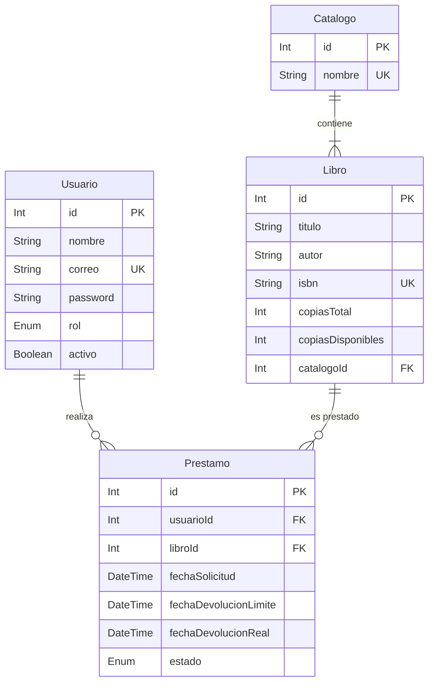

# Modelos de Entidades y Restricciones (models/entidades) - Simulación

Este documento describe la especificación detallada del esquema de datos relacional y las restricciones de base de datos que administra Prisma ORM.

## Diccionario de Datos

### 1. Entidad `Usuario`
Representa a los miembros de la biblioteca y al personal administrativo.
* **`id`** (`Int`): Clave primaria, autoincremental.
* **`nombre`** (`String`): Nombre completo del usuario (máximo 100 caracteres, obligatorio).
* **`correo`** (`String`): Correo electrónico institucional. Restricción: Único (`@unique`), con índice de búsqueda.
* **`password`** (`String`): Hash encriptado de la contraseña (obligatorio).
* **`rol`** (`Enum`): Define el nivel de privilegios. Valores válidos: `ADMIN`, `BIBLIOTECARIO`, `LECTOR`.
* **`activo`** (`Boolean`): Indicador de estado de la cuenta. Por defecto: `true`.
* **`createdAt`** (`DateTime`): Fecha de creación. Por defecto: `now()`.
* **`updatedAt`** (`DateTime`): Actualizado automáticamente en cada cambio.

### 2. Entidad `Libro`
Ficha bibliográfica de cada ejemplar en existencia en la biblioteca.
* **`id`** (`Int`): Clave primaria, autoincremental.
* **`titulo`** (`String`): Título de la obra (máximo 200 caracteres, obligatorio, indexado).
* **`autor`** (`String`): Nombre del autor (máximo 100 caracteres, obligatorio).
* **`editorial`** (`String`): Editorial (opcional).
* **`isbn`** (`String`): Código internacional estándar del libro. Restricción: Único y opcional.
* **`copiasTotal`** (`Int`): Ejemplares totales registrados (mínimo 1).
* **`copiasDisponibles`** (`Int`): Ejemplares listos para préstamo virtual.
* **`catalogoId`** (`Int`): Clave foránea que asocia el libro a un catálogo específico.

### 3. Entidad `Catalogo`
Agrupaciones o secciones de libros por temas.
* **`id`** (`Int`): Clave primaria, autoincremental.
* **`nombre`** (`String`): Nombre de la categoría (ej. "Ciencias exactas", "Historia", "Novela"). Restricción: Único.

### 4. Entidad `Prestamo`
Transacción de préstamo de un libro a un usuario.
* **`id`** (`Int`): Clave primaria, autoincremental.
* **`usuarioId`** (`Int`): Clave foránea. Relaciona el préstamo con un `Usuario`.
* **`libroId`** (`Int`): Clave foránea. Relaciona el préstamo con un `Libro`.
* **`fechaSolicitud`** (`DateTime`): Registro de cuándo se solicitó el libro. Por defecto: `now()`.
* **`fechaDevolucionLimite`** (`DateTime`): Plazo establecido para el lector (por defecto 15 días posteriores a `fechaSolicitud`).
* **`fechaDevolucionReal`** (`DateTime`): Fecha exacta de retorno físico/digital (nulo si sigue activo).
* **`estado`** (`Enum`): Estado del préstamo. Valores válidos: `ACTIVO`, `DEVUELTO`, `VENCIDO`.

---

## Diagrama Entidad-Relación Conceptual (Mermaid)

_Boceto de base de datos relacional para el flujo de Git — Sin código ejecutable._
